**Remarque préliminaire : ceci est un document de travail. Merci de ne pas tenir compte des nombreuses fautes et coquilles.  **

# Données explorées à ce jour (05/03/2025) :

* [Maus *et al.* (2020)](https://www.nature.com/articles/s41597-020-00624-w) et [Maus *et al.* (2022)](https://www.nature.com/articles/s41597-022-01547-4) 
	* Pour [télécharger](https://doi.pangaea.de/10.1594/PANGAEA.942325?format=html#download) ou [consulter](https://www.fineprint.global/visualisations/viewer/) les données 2022
* [Tang and Werner (2023) Global mining footprint mapped from high-resolution satellite imagery ](https://www.nature.com/articles/s43247-023-00805-6)
    * Pour [télécharger](https://doi.org/10.5281/zenodo.6806817) les données.
* [Open Street Map](https://www.openstreetmap.org/) (extraction du 05 mars 2025)

# Webmap AGOL

[https://arcg.is/19H4jj](https://arcg.is/19H4jj) (dernière mise à jour le 05 mars 2025)

---

# Maus *et al.* 2020 et 2022

Global-scale Data Set of mining area

Résumé :

- Caractéristiques minières en surface qui ont pu être identifiées à partir des images satellite, y compris les mines à ciel ouvert (open cuts), les digues à résidus (tailings dams), les terrils, accumulations de déchets miniers (waste rock dumps), les bassins de rétention (water ponds) et les usines de transformation (processing infrastructure).
- 2020 : 21 060 polygones (57 277 km²) 121 pays
- 2022 : 44 929 polygones (201 583 km²) 145 pays
- On s'intéresse plus ici précisément au jeu de données de 2022. Il vient compléter le jeu de données de 2020 (et aussi deux autres recherches non comparables entre elles du fait des résolutions spatiales et temporelles des données utilisées) construits par photo-interprétation d'images satellites haute résolution.
- Activité minières en cours = toutes les terres utilisées par le secteur minier à n’importe quelle étape de l’extraction et du traitement sur le site d’exploitation
- Toutes les infrastructures minières souterraines et aériennes visibles sur les images satellites
- *large-scale mining (LSM) ET artisanal small-scale mining (ASM)*
- Utilise la base [SNL](https://www.spglobal.com/marketintelligence/en/campaigns/metals-mining) (certains points qui y sont reportés comme inactifs sont actifs *a priori* sur les images). Tous les points sont donc utilisés indépendamment de leur état déclaré. Ces données sont *a priori* non libres.
- Photo interprétation (pas de télédétection) à partir de Sentinel 2 Cloudless
- 10km autour de chaque point de la base (avec adaptation si la zone s'étend sur de longues distances) = prise en compte des imprécisions de localisation des sites miniers
- Mise à jour des polygones de la version 1 (utilisation d'images de 2019) et ajout de polygones.
- Plus de zones ASM (presque absentes de la v1)
- Pour chaque polygone :
	- Pas d'attribut associé autre que Pays et Superficie
	- Pas de lien  avec SNL

# Tang and Werner 2023

Global mining footprint mapped from high-resolution satellite imagery

Résumé :

- Donnée mondiale sur l'utilisation des terres à des fins minières grâce à l'analyse par télédétection d'images satellite haute résolution accessibles au public 
- 74 548 polygones (66 000 km²) 135 pays dont 79% dans 13 pays (de quoi laisser des blancs dans les cartes ;-))
 dans 
- Décharges de stériles, mines, bassins d'eau, barrages de résidus, amas de plateformes de lixiviation, infrastructures de traitement/broyage (waste rock dumps, pits, water ponds, tailings dams, heap leach pads and processing/milling infrastructure).
- les polygones délimitent précisément les contours des éléments miniers
- *large-scale mining (LSM) ET artisanal small-scale mining (ASM)*
- Utilise la base [SNL](https://www.spglobal.com/marketintelligence/en/campaigns/metals-mining) et [mindat.org](https://www.mindat.org/)
- Annoncé comme télédétection à partir d'images satellite haute résolution ? En fait, photointerpréation depuis Google Earth Pro (avec données de résolutios hétérogènes)  + Sentinel II

**Note** : chercher des publis utilisant la télédetection (classification dirigée, demi dirigée, automatique, IA...)


# OSM

## Préambule

Le résultats des extractions présentées ci-desous sont disponibles au format `XML` empaqueté dans un fichier `*.7z` dans le [dossier `data`](./data/). Le nom des fichiers inclut la date et l'heure d'extraction. La date et l'heure d'extraction sont indiqués dans l'entête des fichiers. 

Un `geopackage` incluant l'ensemble des couches est également disponible (compatible avec `QGIS` bien sûr, mais aussi `ArcGIS Pro`). Pour l'heure et la date d'extraction, il faut se référer au nom du `XML` correspondant.

Les chiffres contenus dans les tableaux d'effectifs ci après correspondent aux extractions du 05 mars. 

Enfin les données sont consultables sur la [Webapp](https://arcg.is/19H4jj) (dernière mise à jour le 05 mars 2025)


## Questions prélimiminaires :
* Qu'est-ce qui est cartographié ? Activité actuelle ou passée ?
* Quelle source ?
* Quelle fiabilité ?

## Overpass API

Extraction est possible via [Overpass Turbo](https://overpass-turbo.eu/)

Nous avons opté pour une extraction directement en utilisant l'API Overpass en ligne de commande sous Ubuntu 24.04 en utilsant la commande `wget`.

Pour ce faire, nous utilisons le language `Overpass QL` ("Overpass Query Language"), dont une documentation se trouve [ici](https://wiki.openstreetmap.org/wiki/Overpass_API/Overpass_QL) et une autre [ici](https://osmlab.github.io/learnoverpass/en/docs/).

Pour l'instant, le format choisi en sortie est le `XML`.

Pour ce faire :
Créér un fichier `query.txt` stocke la requête `Overpass QL` d'extraction. Nous revenons plus loin sur la structure des requêtes.
Il est stocké dans un dossier.

Dans un terminal, se rendre dans ce dossier.

```
cd /home/`...`/`Nom du dosssier`

```
```
wget --post-file=query.txt http://overpass-api.de/api/interpreter --output-document=result.xml

```
On obtient alors un fichier au format `XML` `result.xml`


## Taginfo API

[TagInfo](https://wiki.openstreetmap.org/wiki/FR:Taginfo/API) est un outil de recherche et d’agrégation d'informations sur les balises (tags) d'OSM. Ces informations sont alors consultables via un navigateur. Pour les `tags` retenus, nous indiquons les URL permettant de consulter cesinfos.

Par ailleurs, nous mettons à disposition un script `python` permettant de directement interroger l'API. Il est disponible dans le dossier [scripts](./scripts/tag_info.py).


## Structure des données OSM

Les données Open Street Map reprennent ces éléments.

Elles sont constituées par les [éléments](https://wiki.openstreetmap.org/wiki/FR:%C3%89l%C3%A9ments) fondamentaux de la cartographie OSM :
* les noeuds ou `node` (points)
* les chemins `way`
    * `lines` (lignes) quand elles sont ouvertes : `open way`et `MultiLineString`
    * `(multi)polygons` quand elle sont closes : `closed way`
    * `area` (surfaces)
* les `relations` sont des collections d'objets (nous en avons croisé peu sur la thématique minière).
* les attributs `tags` : `key` + `value` (une clé et une valeur)

Un `node` peut-être indépendant ET / OU appartenir à une `way`

Par exemple, dans les fichier `XML` (industrial_eq_mine.xml), les `node`portant les identifiants `id=6421582144`  et `id=6421582201` sont à la fois indépendants car ils portent des `tag` distincts (`entrance=*`) mais il font également partie de la `way`portant l'`id=235079770`.

|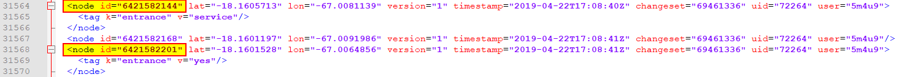|
| -----------  |
|*Deux `node` intégrés dans une `way`* |

|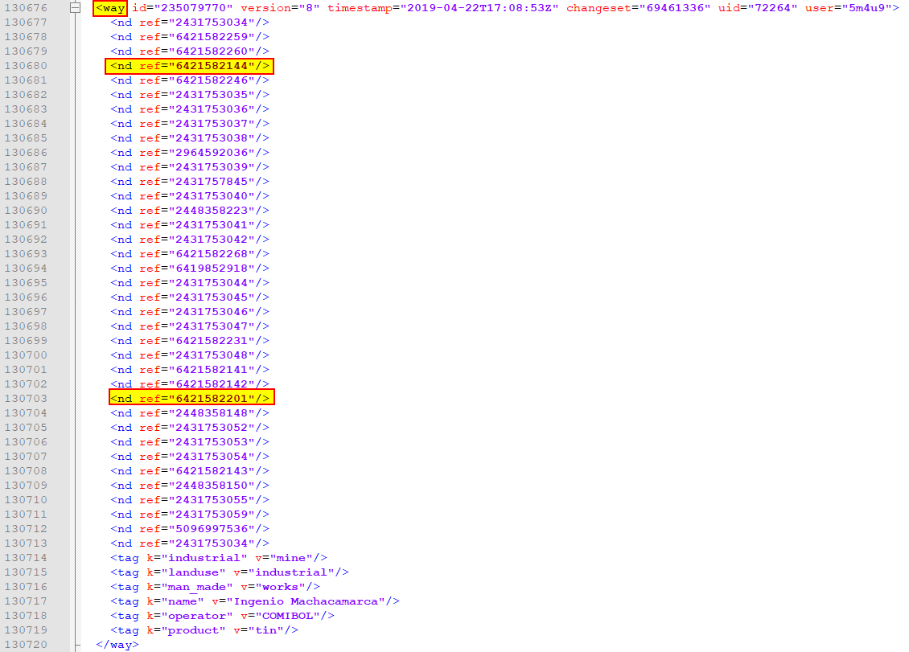|
| -----------  |
|*La `way` intégrant dans les deux `node`* |

|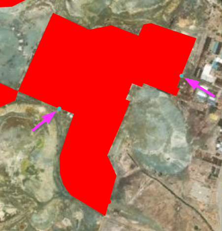|
| -----------  |
|*La `way` et les deux `node`* (2023)|

A l'inverse, certains `node` sont indépendants de toute `way` celui portant les identifiants `id=11452275634` . 

Notons au passage qu'il ne s'agit pas d'une minde, mais d'une gravière (carrière ?) "Heidelberg Materials France Granulats (anciennement GSM)" (source : [Google map](https://maps.app.goo.gl/k1zRWimrtXjZ7CDn7))...

225 des 310 points (72,6%) cette couche touchent la limite d'un polygone et corresdonpent certainement à des `node` inclus dasn des `way`.  

Comme nous l'expliquons plus pas, nous avons obtenez pour une extraction incluant les métadonnées et notamment l'`uid` et le nom `user` du contibuteur (*cf.* illustrations)


## Analyse des contributions et des contributeurs

Nous avons développé plusieurs petits scripts `Python`.

### Analyser les extractions OSM 

Nous récupérons donc les données OSM au format `XML`.

[`contribution_analysis_in_XLM_files.py`](./scripts/contribution_analysis_in_XLM_files.py) analyse des métadonnées afin d'obtenir le nombre et le type de contributions par `user`. Il renvoie pour chaque fichier `XML`une table au format `csv` dans le quel les informations suivantes sont inscrites :

Il donne pour chaque utilsateur un tableau de type :

| `user` | `uid` | `contribution` | `first_contribution` | `last_contribution` | `node` | `node_point` | `node_in_way` | `way` | `relation` | `changeset` |
| ----------- | ----------- | ----------- | ----------- | ----------- | ----------- | ----------- | -----------	 | ----------- | ----------- | ----------- |
| ... | ... | ... | ... | ... | ... | ... | ...	 | ... | ... | ... |
| ... | ... | ... | ... | ... | ... | ... | ...	 | ... | ... | ... |
| TOTAL |  | ... |  |  | ... | ... | ...	 | ... | ... | ... | ... |

où : 
* `user` est le nom d'utilisateur OSM
* `uid` est le userid
* `contribution` est le nombre total de contributions
* `first_contribution` est la date de première contibution
* `last_contribution` est le date de dernière
* `node` est le nombre de total de `node`
* `node_point` est le nombre de `node` isolés (*i.e.* non inclus dans une `way`)
* `node_in_way` est le nombre de `node` constitutifs d'une `way`
* `way` est le nombre de `way`
* `relation` est le nombre de `relation` 
* `changeset` est le nombre total de `changeset`

La dernière ligne, comme son nom l'indique, correspond à un total des colonnes sommables.
Ce total nous donne une autre estimation du nombre d'éléments. Il sera comparé avec les décomptes issus des imports dans QGIS et de Taginfo.

Le script est disponible dans le dossier [`scripts`](./scripts/contribution_analysis_in_XLM_files.py)

Concernant, les infos récoltées par ce script, le nombre de `changeset` par utilisateur nous intéresse plus particulièrement. Un `changeset` est une liste de changements effectués durant une période de temps par un même utilisateur quelles que soient ces modifications. Il est le signe d'une activité ponctuelle sur la base de données cartographique OSM indépendamment d'un nombre de `node`, `way`, `relation`

Bien sûr, un même changeset peu concerner plusieurs `tag`. Pour un même utilisateur, le nombre de changeset ne peut pas être estimé par la somme des données recueillies tag par tag avec le script précédent.

Nous avons donc créé un autre script `python` [`single_user_list.py`](./scripts/single_user_list.py) qui permet de récupéré la liste complet des user pour l'ensemble des extractions (ou d'un groupe de fichier XML) et le nombre de `changeset` unique pour chaque `user`.

Les informations concernant les utilisateurs nous intéressent aussi. Nous avons créé un autre scripts `python` [`user_information.py`](./scripts/user_informations.py) qui permet de récupérer ces information vi l'API OSM à partir de la liste créée précédemment. Le nombre d'informations est limité : date de création de compte, présentation (rédigée à la discrétion de l'utilisateur). Ces infos sont donc difficielement utilsables puisqu'elles sont lacunaires et nécessitent une fouille complémentaire des descriptions.


## Récupération des données OSM
Nous avons récupéré les données à partir d'un certain nombre de `tags` en nous basant sur les valeurs en lien avec l'industrie minière.

### Value `Mine`

Les mines au sens "générique".

---

#### `"industrial"="mine"`

[Wiki OSM sur les mines](https://wiki.openstreetmap.org/wiki/Tag:industrial=mine)

La `key``industrial`permet de renseigner le type d'industrie. [Plus d'info](https://wiki.openstreetmap.org/wiki/FR:Key:industrial)

```
[out:xml] [timeout:25];
(
    node["industrial"="mine"](-90,-180,90,180);
    way["industrial"="mine"](-90,-180,90,180);
    relation["industrial"="mine"](-90,-180,90,180);
);
(._;>;);
out meta;
```

Il est possible de simplifié la requête comme cela !

```
[out:xml] [timeout:25];
(
    nwr["industrial"="mine"](-90,-180,90,180);
);
(._;>;);
out meta;
```

| Type | Effectifs |
| -----------  | -----------  |
| Nodes  | 311  |
| lines | 214  |
| multistrings  | 0  |
| multipolygons  | 3428  |
| relations | 0  |

Le tableau ci-dessus présente les objets récupérés lors de l'importation des `xml` (extraits le 05/03/2025) dans QGIS.

L'API *taginfo* renvoie des informations proches, mais sensiblement différentes  : [https://taginfo.openstreetmap.org/tags/industrial=mine](https://taginfo.openstreetmap.org/tags/industrial=mine).

| Type | Nombre d'objets (2025-03-05 00:59 UTC) | Script "maison" |
| -----------  | -----------  | -----------  |
| Tous | 3 471 | 4378 |
| Nœud| 86 | 85 |
| Chemin | 3 185 | 4093 |
| Relation | 200 | 200 |


Cela peut s'expliquer par la méthode d'extraction utilisée, l'importation dans QGIS ou bien la temporalité de l'extraction. Par ailleurs, les `node` semblent correspondre à des `node` indépendants de toute `way` (85 comptabilisés plus haut). -> **Ce point est à creuser**.

La chronologie, corroborée par l'API [OSM Tag History](https://taghistory.raifer.tech/?#***/industrial/mine), montre un `tag` en constante et nette évolution depuis 2018. 

Dans l'API *taginfo*, la recherche sur le `tag` `industrial=mine` renvoie le tag "officiel" ainsi qu'[une série de d'autres tags](https://taginfo.openstreetmap.org/search?q=industrial%3Dmine) tels que `industrial=solution_mine` (62 objets) (Lixiviation in situ) ou `disused:indutrial=mine` (27 objets) et `abandonned:industrial=mine` (10 objets). Nous reviendrons sur ces deux derniers `key` plus loin. Les autres à des effectifs très faibles que nous négligerons. La liste complète est proposée ci-dessosu (données du 2025-02-27 00:59 UTC)

| Quantité | Clé | Valeur |
| -----------  | -----------  | -----------  |
| 3 468 | industrial | mine |
| 62 | industrial | solution_mine |
| 27 | disused:industrial | mine |
| 10 | abandoned:industrial | mine |
| 5 | industrial | mine_restoration |
| 1 | industrial | mine office |
| 1 | industrial | coal_mine |
| 1 | industrial | mine_tailings |
| 1 | industrial | sand_mine |
| 1 | industrial:1921-1952 | mine |
| 1 | was:industrial | mine |
| 1 | historic:industrial | mine |

Une extraction complémentaire en utilisant le  `tag` `industrial=solution_mine` montre que les polygones (uniquement) sont concentrés sur 4 zones du globe, et que leur position n'est pas systématiquement contraintes par la présence d'objets de `industrial=mine` ou de `landuse=mine` (*cf* ci-après). Bien sur, des proximités apparaissent en lien certainement, c'est à vérifier, avec la contexte géologique (*e.g.* exemple de la *Mosaic Potash Canada* ci-dessous avec la présence de plusieurs carrières à proximité)

```
[out:xml] [timeout:25];
(
    nwr["industrial"="solution_mine"](-90,-180,90,180);
);
(._;>;);
out meta;
```

|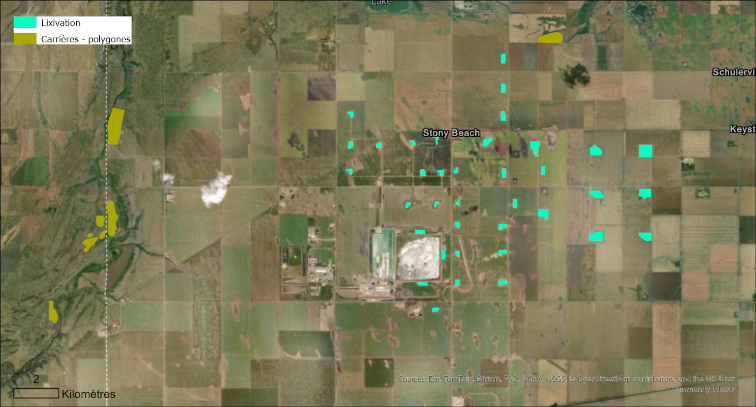|
| -----------  |
|*Mosaic Potash Canada* (2021)|

URI Géo : [geo:50.43263,-105.21315](geo:50.43263,-105.21315?z=14)

Dans l'exemple cette exemple se pose aussi la multiplicité des objets. En effet, ils peuvent être considérés soit comme plusieurs sites intépendants, soit comme faisant partie d'un tout. 

La *Janet Ivy Mine* (Australie) est elle concernée par les 2 tags (et même 3) : un polygone de lixivation est bien inclu dans polygone minier au même titre que 2 pygones de carrières. 

|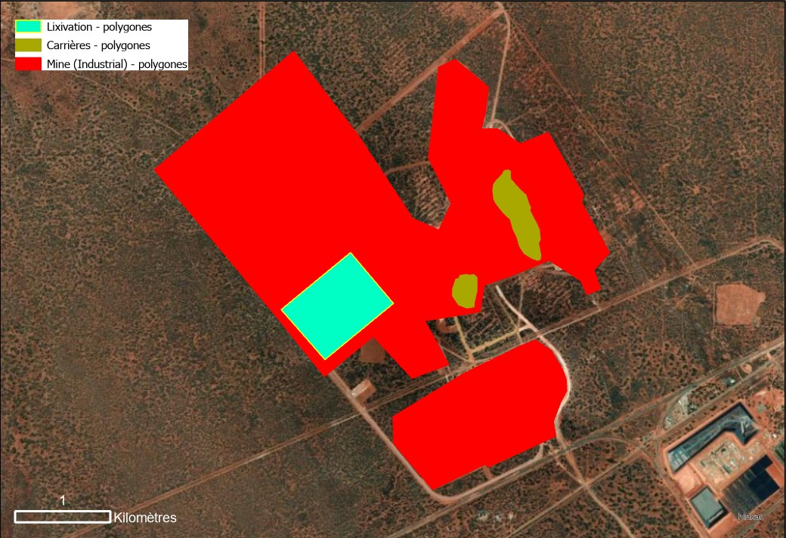|
| -----------  |
|*Mungali Gold Mine* (2023)|

URI Géo : [geo:-30.77893,121.36640](geo:-30.77893,121.36640?z=15)


| Type | Effectifs |
| -----------  | -----------  |
| Nodes  | 0  |
| lines | 0  |
| multistrings  | 0  |
| multipolygons  | 62  |
| relations | 0  |

Le tableau ci-dessus présente les objets récupérés lors de l'importation des `xml` (extraits le 05/03/2025) dans QGIS.

L'API *taginfo* renvoie des informations proches, mais sensiblement différentes  : [https://taginfo.openstreetmap.org/tags/industrial=solution_mine](https://taginfo.openstreetmap.org/tags/industrial=solution_mine).

| Type | Nombre d'objets (2025-03-05 00:59 UTC) | Script "maison" |
| -----------  | -----------  | -----------  |
| Tous | 62 | 63 |
| Nœud| 0 | 0 |
| Chemin | 61 | 62|
| Relation | 1 | 1 |


---
_Plusiers remarques_ concernant la requête d'extraction et les résulats :
* Note : La ligne `(._;>;);` permet *a priori* de récupérer tous les objets appartenant à l'ensemble défini préalablement et ce de manière à créer une collection complète d'objets liés. `._` fait donc référence à l'ensemble initial d'objets, `>;` est un opérateur de récursivité qui récupère tous les  objets de l'ensemble, y compris les nœuds, les chemins et les relations et le `;` terminal clos la requête.

* Note 2 : la commande `out` permet de configurer le résultat de l'export. `ids` affiche uniquement l'identifiant des nœuds, `tags` affiche uniquement l'identifiant et les tags attachés à un nœud. `skel` affiche uniquement l'identifiant et la géométrie, `body` affiche l'identifiant, la géométrie et les tags. `meta` - affiche l'identifiant, la géométrie, les tags ainsi que l'historique des modifications mais aussi les métadonnées (dont user, user id). Nous avons donc optez pour l'option `meta`.

* Note 3 : la nationalité des utilisateurs est plus difficile à récupérer : elle n'est pas indiquée dans les extractions. Elle apparait sur la page de de cahque utilisateur et est simplement déclarative. Une analyse des contributions de chaque utilisateurs pourrait nous donner une estimation de sa nationalité. Mais le travail serait lourd. 

* Note 4 : de nombreux `node` retournés n'ont pas de tags. Cela s'explique généralement par le fait que ces `node` sont utilisés comme membres d'un `way` ou d'une `relation` (*e.g.* pour décrire l'emplacement d'un site). Dans ce cas, ils ne constituent pas forcément des points d'intérêt en eux-mêmes.


---
#### `"landuse"="mine"`

La `key` `landuse` permet de renseigner l'utilisation du sol. [Plus d'info](https://wiki.openstreetmap.org/wiki/FR:Key:landuse)

```
[out:xml] [timeout:25];
(
    nwr["landuse"="mine"](-90,-180,90,180);
);
(._;>;);
out meta;
```

| Type | Effectifs |
| -----------  | -----------  |
| nodes  | 944  |
| lines | 0  |
| multistrings  | 0  |
| multipolygons  | 58  |
| relations | 0  |

L'API *taginfo* renvoie des informations proches, mais sensiblement différentes  : [https://taginfo.openstreetmap.org/tags/landuse=mine](https://taginfo.openstreetmap.org/tags/landuse=mine).


| Type | Nombre d'objets (2025-03-05 00:59 UTC) | Script "maison" |
| -----------  | -----------  | -----------  |
| Tous | 999 | 1 001 |
| Nœud| 941 | 941 |
| Chemin | 57 | 59 |
| Relation | 1 | 1 |

Parmi  les alternatives  proposé par l'API [taginfo](https://taginfo.openstreetmap.org/search?q=landuse%3Dmine)

| Quantité | Clé |  Valeur |
| -----------  | -----------  | -----------  |
| 1 000 | landuse | mine | 
| 159 | landuse | mine_spoils | 
| 2 | abandoned:landuse | mine | 
| 2 | landuse | mine_spoils_recultivated | 
| 2 | landuse | Mine | 
| 1 | landuse_1 | Artisanal Mine Site | 
| 1 | abandoned:landuse | mine_spoils | 
| 1 | landuse | mine_tip | 
| 1 | landuse | mine_spoil | 
| 1 | landuse | surface_mine

Le `tag` `landuse=mine_spoils`retenu notre attention au vu de son effectif (159) et considérant qu'il est certainement complémentaire du `tag` `man_made=spoil_heap` que nous présentons plus bas. Une extraction a donc été réalisée pour évaluation.


```
[out:xml] [timeout:25];
(
    nwr["landuse"="mine_spoils"](-90,-180,90,180);
);
(._;>;);
out meta;
```

| Type | Effectifs |
| -----------  | -----------  |
| nodes  | 0  |
| lines | 1  |
| multistrings  | 0  |
| multipolygons  | 160  |
| relations | 0  |


Sur les 160 polygones, 116 sont par exemple localisés autour de la localité de Brand-Erbisdorf (Allemagne), ville connus pour avoir abrité une activité minière associées )à l'[extraction de l'argent jusqu'en 1963](https://fr.wikipedia.org/wiki/Brand-Erbisdorf#Histoire).

Sur ces 116 polygones, 115 sont par ailleurs déjà intégrés dans la couches des Terrils (Spoil heaps) que nous préseterons plus bas. Plus globalement, 157 sur 160 (polygones) sont donc doublonnés de fait de l'utilisation des 2 tags différents.

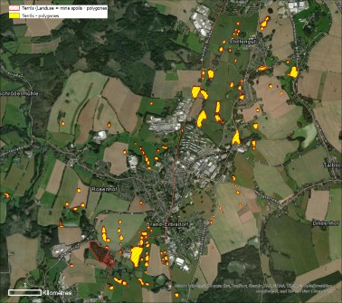|
| -----------  |
|*Brand Erbisdorf historic silver mine spoils* (2023)|

URI Géo : [geo:50.86708,13.31079](geo:50.86708,13.31079?z=14)

Enfin, dans les deux couches, la quasi totalité des éléments porte l'information "historic=yes" qui permettrait de les (seulement deux avec la valeur NULL et un avec la valeur razed=mineshaft)

Ces terrils ne sont pas visibles dans le paysage, tout du moins par mon oeil "non-expert". Ils semblent de faible hauteur, géréralement boisés. 

L'API *taginfo* renvoie des informations proches, mais sensiblement différentes  : [https://taginfo.openstreetmap.org/tags/landuse=mine](https://taginfo.openstreetmap.org/tags/landuse=mine_spoils).


| Type | Nombre d'objets (2025-03-05 00:59 UTC) | Script "maison" |
| -----------  | -----------  | -----------  |
| Tous | 159 | 163 |
| Nœud| 0 | 0 |
| Chemin | 157 | 161 |
| Relation | 2 | 2 |


---

### Value `Quarry`

Les carrières

On utilise la encore la `key` `landuse` 

```
[out:xml] [timeout:25];
(
    nwr["landuse"="quarry"](-90,-180,90,180);
);
(._;>;);
out meta;
```

| Type | Effectifs |
| -----------  | -----------  |
| nodes  | 33 237  |
| lines | 6 837  |
| multistrings  | 0  |
| multipolygons  | 213 451  |
| relations | 8  |

Question sur les carrières : **sont-ce des mines ?** 

Remarque : certaines carrières sont bien intégrées à des secteurs miniers.

|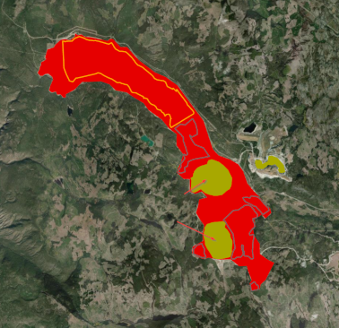|
| -----------  |
|*Highland Valley Copper Mine* (Canada)|

URI Géo : [geo:50.4961,-121.0958](geo:50.4961,-121.0958?z=12)


L'API *taginfo* renvoie des informations proches, mais sensiblement différentes  : [https://taginfo.openstreetmap.org/tags/landuse=quarry](https://taginfo.openstreetmap.org/tags/landuse=quarry).


| Type | Nombre d'objets (2025-03-05 00:59 UTC) | Script "maison" |
| -----------  | -----------  | -----------  |
| Tous | 239 018 | 275 170 |
| Nœud| 30 854 | 30 846 |
| Chemin | 198 251 | 234 411 | 
| Relation | 9 913 | 9 913 |

Parmi  les `tags` alternatifs  proposé par l'API [taginfo](https://taginfo.openstreetmap.org/search?q=landuse%3Dquarry), la quasi majorité est en lien avec l'aspect historique. Les 4 plus utilisés sont à l'instant t :

| Quantité | Clé |  Valeur |
| -----------  | -----------  | -----------  |
| 1 879 | abandoned:landuse | quarry | 
| 1 536 | disused:landuse | quarry | 
| 544 | was:landuse | quarry | 
| 68 | historic:landuse | quarry | 
| ... | ... | ... |


---
### Value `Mineshaft`

Les puits de mine

La `key` `man_made` permet d'identifier les structures et constructions fabriquée par l'humain (artificielle) ajoutée au paysage. [Plus d'info](https://wiki.openstreetmap.org/wiki/FR:Key:man_made). 

```
[out:xml] [timeout:25];
(
    nwr["man_made"="mineshaft"](-90,-180,90,180);
);
(._;>;);
out meta;

```

| Type | Effectifs |
| -----------  | -----------  |
| nodes  | 14 119 |
| lines | 1 492  |
| multistrings  | 0  |
| multipolygons  | 1 477  |
| relations | 2  |


L'API *taginfo* renvoie des informations proches, mais sensiblement différentes  : [https://taginfo.openstreetmap.org/tags/man_made=mineshaft](https://taginfo.openstreetmap.org/tags/man_made=mineshaft).

| Type | Nombre d'objets (2025-03-05 00:59 UTC) | Script "maison" |
| -----------  | -----------  | -----------  |
| Tous | 16 981 | 17 109 |
| Nœud| 14 039 | 14 029 |
| Chemin | 2 895 | 3 033 |
| Relation | 47 | 47 |


Parmi  les `tags` alternatifs  proposé par l'API [taginfo](https://taginfo.openstreetmap.org/search?q=man_made%3Dmineshaft), on retrouve essentiellement, comme précdemment, l'aspect historique. Les 4 plus utilisés sont à l'instant t :


| Quantité | Clé |  Valeur |
| -----------  | -----------  | -----------  |
| 875 | disused:man_made | mineshaft |
| 599 | abandoned:man_made | mineshaft |
| 211 | razed:man_made | mineshaft |
| 59 | ruins:man_made | mineshaft |
| ... | ... | ... |


---
### Value `Adit`

Les entrée de galeries de mine

On utilise la encore la `key` `man_made` 

```
[out:xml] [timeout:25];
(
    nwr["man_made"="adit"](-90,-180,90,180);
);
(._;>;);
out meta;

```

| Type | Effectifs |
| -----------  | -----------  |
| nodes  | 20 075  |
| lines | 507  |
| multistrings  | 0  |
| multipolygons  | 158  |
| relations | 0  |


L'API *taginfo* renvoie des informations proches, mais sensiblement différentes  : [https://taginfo.openstreetmap.org/tags/man_made=adit](https://taginfo.openstreetmap.org/tags/man_made=adit).

| Type | Nombre d'objets (2025-03-05 00:59 UTC) | Script "maison" |
| -----------  | -----------  | -----------  |
| Tous | 20 679 | 20 624 | 
| Nœud| 20 017 | 20 011 |
| Chemin | 656 | 670 |
| Relation | 6 | 6 |


Parmi  les `tags` alternatifs  proposé par l'API [taginfo](https://taginfo.openstreetmap.org/search?q=man_made%3Dadit), on retrouve essentiellement, comme précdemment, l'aspect historique. Les 5 plus utilisés sont à l'instant t :


| Quantité | Clé |  Valeur |
| -----------  | -----------  | -----------  |
| 586 | ruins:man_made | adit |
| 234 | disused:man_made | adit |
| 158 | abandoned:man_made | adit |
| 131 | razed:man_made | adit |
| 24 | man_made | mine_adit |
| ... | ... | ... |

Le 5<sub>ième</sub> utilise la valeur non précognisée (*mine_adit*). 


---
### Value `Heap`

Définition : *a big pile of material*

**Ce tag est à discuter**

Si on le maintient, certainement à coupler avec le requête : `"industrial"="mine"` 

```
[out:xml] [timeout:25];
(
    nwr["man_made"="heap"](-90,-180,90,180);
);
(._;>;);
out meta;

```

| Type | Effectifs |
| -----------  | -----------  |
| nodes  | 39  |
| lines | 533  |
| multistrings  | 0  |
| multipolygons  | 44 763  |
| relations | 0  |


L'API *taginfo* renvoie des informations proches, mais sensiblement différentes  : [https://taginfo.openstreetmap.org/tags/man_made=heap](https://taginfo.openstreetmap.org/tags/man_made=heap).

| Type | Nombre d'objets (2025-03-05 00:59 UTC) | Script "maison" |
| -----------  | -----------  | -----------  |
| Tous | 45 328 | 46 247 |
| Nœud| 36 | 36 |
| Chemin | 45 199 | 46 118 |
| Relation | 93 | 93 |


Parmi  les `tags` alternatifs  proposés par l'API [taginfo](https://taginfo.openstreetmap.org/search?q=man_made%3Dheap), on retrouve essentiellement, comme précdemment, l'aspect historique. Les 6 plus utilisés sont à l'instant t :


| Quantité | Clé |  Valeur |
| -----------  | -----------  | -----------  |
| 5 948 | man_made | spoil_heap | 
| 403  | man_made | peat_heap | 
| 57 | disused:man_made | spoil_heap | 
| 21 | abandoned:man_made | spoil_heap | 
| 14 | man_made | slag_heap | 
| 10 | man_made | soil_heap | 
| ... | ... | ... |

Bien sûr, le `tag` `man_made=spoil_heap` arrive en tête. Ce dernier sera sera abordé juste après. Les valeurs `peat_heap`et `slag_heap`ainsi que `soil_heap`(soil ou spoil ?) sont également utilisées. Et on retrouve l'aspect historique.

---
### Value `Spoil_heap`

Les terrils

On utilise là encore la `key` `man_made` 

Note : *A priori* en lien avec la mine. Vérifier quel est le lien avec le `tag` `"industrial"="mine"` 

```
[out:xml] [timeout:25];
(
    nwr["man_made"="spoil_heap"](-90,-180,90,180);
);
(._;>;);
out meta;

```

| Type | Effectifs |
| -----------  | -----------  |
| nodes  | 142  |
| lines | 2 861 |
| multistrings  | 0  |
| multipolygons  | 3 136  |
| relations | 1  |


L'API *taginfo* renvoie des informations proches, mais sensiblement différentes  : [https://taginfo.openstreetmap.org/tags/man_made=spoil_heap](https://taginfo.openstreetmap.org/tags/man_made=spoil_heap).

| Type | Nombre d'objets (2025-03-05 00:59 UTC) | Script "maison" |
| -----------  | -----------  | -----------  |
| Tous | 5 948 | 6 680 |
| Nœud| 103 | 102 |
| Chemin | 5 658 | 6391 |
| Relation | 187 | 187 |


Parmi  les `tags` alternatifs  proposés par l'API [taginfo](https://taginfo.openstreetmap.org/search?q=man_made%3Dspoil_heap), on retrouve essentiellement, comme précédemment, l'aspect historique. Les 3 plus utilisés sont à l'instant t :


| Quantité | Clé |  Valeur |
| -----------  | -----------  | -----------  |
| 57 | disused:man_made | spoil_heap |
| 21| abandoned:man_made | spoil_heap |
| 2 | razed:man_made | spoil_heap |
| ... | ... | ... |

---
### Value `Landfill`

Le `tag` suivant est abandonné. *A priori*, il s'agit uniquement de décharges. A vérifier éventuellement.


~~### Décharge~~

~~Landfill : A site for permanent or long term storage of waste~~

~~[out:xml] [timeout:25];
(
    nwr["landuse"="landfill"](-90,-180,90,180);
);
(._;>;);
out meta;~~

---
### Value `Tailings_pond`

Les bassins de décantation

On utilise la encore la `key` `man_made` 

```
[out:xml] [timeout:25];
(
    nwr["man_made"="tailings_pond"](-90,-180,90,180);
);
(._;>;);
out meta;
```

| Type | Effectifs |
| -----------  | -----------  |
| nodes  | 7  |
| lines | 2228  |
| multistrings  | 0  |
| multipolygons  | 2366  |
| relations | 0  |

Problème : les `Tailings pond` ne sont pas uniquement présentes (et cartographiés) sur des sites miniers. Par exemple, sur le site du *Imperial Oil's Ioco Terminal* (Vancouver)

|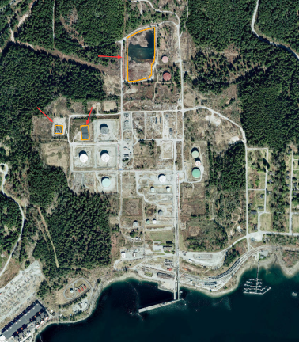|
| -----------  |
|*Imperial Oil's Ioco Terminal* (2021)|

URI Géo : [geo:49.30642,-122.88188](geo:49.30642,-122.88188?z=16)


L'API *taginfo* renvoie des informations proches, mais sensiblement différentes  : [https://taginfo.openstreetmap.org/tags/man_made=tailings_pond](https://taginfo.openstreetmap.org/tags/man_made=tailings_pond).

| Type | Nombre d'objets (2025-03-05 00:59 UTC) | Script "maison" |
| -----------  | -----------  | -----------  |
| Tous | 4 087 | 4 774 |
| Nœud| 0 | 0 |
| Chemin | 4 000 | 4 688 |
| Relation | 87 | 86 |


Parmi  les `tags` alternatifs  proposés par l'API [taginfo](https://taginfo.openstreetmap.org/search?q=man_made%3Dtailings_pond), on retrouve essentiellement, comme précédemment, l'aspect historique. Les 2 plus utilisés sont à l'instant t :


| Quantité | Clé |  Valeur |
| -----------  | -----------  | -----------  |
| 5 | was:man_made | tailings_pond |
| 2 | disused:man_made | tailings_pond |
| ... | ... | ... |

---

### Données historiques

L'aspect historique est également pris en compte. 

#### Tags `historic=mine`

Mines historiques

```
[out:xml] [timeout:25];
(
    nwr["historic"="mine"](-90,-180,90,180);
);
(._;>;);
out meta;
```

| Type | Effectifs |
| -----------  | -----------  |
| nodes  | 9 943  |
| lines | 136  |
| multistrings  | 0  |
| multipolygons  | 2 921  |
| relations | 14  |

L'API *taginfo* renvoie des informations proches, mais sensiblement différentes  : [https://taginfo.openstreetmap.org/tags/historic=mine](https://taginfo.openstreetmap.org/tags/historic=mine).

| Type | Nombre d'objets (2025-03-05 00:59 UTC) | Script "maison" |
| -----------  | -----------  | -----------  |
| Tous | 12 672 | 13 016 |
| Nœud| 9 728 | 9 780 |
| Chemin | 2 850 | 3 142 |
| Relation | 94 | 94 |


Parmi  les `tags` alternatifs  proposés par l'API [taginfo](https://taginfo.openstreetmap.org/search?q=historic%3Dmine). Les 8 plus utilisés sont à l'instant t :


| Quantité | Clé |  Valeur |
| -----------  | -----------  | -----------  |
| 10 771 | historic | mine_shaft |
| 624 | historic | mine_adit |
| 63 | historic | mine_level |
| 36 | historic | mine_crater |
| 17 | historic:man_made | mine |
| 16 | historic | mine_cart |
| 4 | man_made:historic | mine |
| 4 | historic | mine_chimney |
| ... | ... | ... |

Parmi ces derniers, on retrouvre majorittairement les deux `tag` que nous abordons ci-dssous `historic=mine_shaft` et `historic=mine_adit` mais également de nombreux `tag` non préconisés.


---

#### Tags `historic=mine_shaft`

Puits de mine historiques

```
[out:xml] [timeout:25];
(
    nwr["historic"="mine_shaft"](-90,-180,90,180);
);
(._;>;);
out meta;
```

| Type | Effectifs |
| -----------  | -----------  |
| nodes  | 10 655  |
| lines | 6  |
| multistrings  | 0  |
| multipolygons  | 120  |
| relations | 1  |

L'API *taginfo* renvoie des informations proches, mais sensiblement différentes  : [https://taginfo.openstreetmap.org/tags/historic=mine_shaft](https://taginfo.openstreetmap.org/tags/historic=mine_shaft).

| Type | Nombre d'objets (2025-03-04 00:59 UTC) | Script "maison" |
| -----------  | -----------  | -----------  |
| Tous | 10  771 | 10 771 |
| Nœud| 10 647 | 10 644|
| Chemin | 123 | 126 |
| Relation | 1 | 1 |


Un seul `tag` alternatif, d'effectifs négligeable, est proposé par l'API [taginfo](https://taginfo.openstreetmap.org/search?q=historic%3Dmine_shaft) :


| Quantité | Clé |  Valeur |
| -----------  | -----------  | -----------  |
|1 | razed:historic | mine_shaft |

---

#### Tags `historic=mine_adit`

Galeries de mine historiques

```
[out:xml] [timeout:25];
(
    nwr["historic"="mine_adit"](-90,-180,90,180);
);
(._;>;);
out meta;
```

| Type | Effectifs |
| -----------  | -----------  |
| nodes  | 544  |
| lines | 89  |
| multistrings  | 0  |
| multipolygons  | 3  |
| relations | 0  |

L'API *taginfo* renvoie des informations proches, mais sensiblement différentes  : [https://taginfo.openstreetmap.org/tags/historic=mine_adit](https://taginfo.openstreetmap.org/tags/historic=mine_adit).

| Type | Nombre d'objets (2025-03-04 00:59 UTC) | Script "maison" |
| -----------  | -----------  | -----------  |
| Tous | 624 | 625 |
| Nœud| 532 | 532 |
| Chemin | 91 | 92 |
| Relation | 1 | 1 |


Seuls 3 `tag` alternatif, d'effectifs négligeable (4), sont proposés par l'API [taginfo](https://taginfo.openstreetmap.org/search?q=historic%3Dmine_adit), et ce pour une `key`(`historic_1`) et 2 `value` (`Large_Disused_Mine_Adit` et `mine-adit`) incorrectes.  

---


#### Autres `tag` permettant de renseigner la temporalité et/ou le caractère historique des éléments

Dans les extractions précédentes, certains objets peuvent correspondre à des anciens sites (indépendemment des `tag``historic=*` mentionnés précédemment). Mais s'ils portent le tag `tag` `"historic"="yes"` il est possible de n'extraire qu'eux.

Par exemple, la requête suivante renvoie les sites miniers portant les `tag` `"industrial"="mine"` et `"historic"="yes"`. 

```
[out:xml] [timeout:500];
(
    nwr["industrial"="mine"]["historic"="yes"](-90,-180,90,180);
);
(._;>;);
out meta;
```

| Type | `"industrial"="mine"` et `"historic"="yes"` | `"historic"="mine"` |
| -----------  | -----------  |
| nodes  | 0 | 9 931  |
| lines | 0 | 136  |
| multistrings  |  0 | 0  |
| multipolygons  | 7 | 2 918  |
| relations |  0 | 14  |


Par ailleurs, la requête invoquant les `tag` `"landuse"="mine"` et `"historic"="yes"` ne renvoie aucun résultat.


```[out:xml] [timeout:500];
(
    nwr["landuse"="mine"]["historic"="yes"](-90,-180,90,180);
);
(._;>;);
out meta;```

Par ailleurs, les mêmes constatations peuvent être faites concernant les puits de mine et la requête suivante :

```[out:xml] [timeout:500];
(
    nwr["industrial"="mine"]["historic"="yes"](-90,-180,90,180);
);
(._;>;);
out meta;
```

| Type | `"man_made"="mineshaft"` et `"historic"="yes"` | `"historic" = "mine_shaft` |
| -----------  | -----------  |
| nodes  | 187 | 10 655   |
| lines | 0 | 6  |
| multistrings  |  0 | 0  |
| multipolygons  | 23 | 121  |
| relations |  0 | 1  |


Petit complication, il existe aussi des caractériqtiques taggées `historic=no`... 


Comme nous l'avons vu précédemment, d'autres `tags` sont à prendre en compte (indépendamment du fait qu'ils ne respectent pas nécessairement les bonnes pratiques de OSM): `disused`,`abandoned`, `was`, `razed`, `ruins`, `ruined`, `demolished`, `removed`,
`destroyed`, `heritage`... et peut-être d'autres 

Ainsi, par exemple, pour une puits de mine abandonné (`man_made=mineshaft`), un objet pourrait être taggé :
Si cette mine est abandonnée, elle 
`man_made=mineshaft` et `abandoned=yes`
Cependant, même si cette pratique n'est pas recommandée, on pourait également trouver `abandoned:man_made=mineshaft` (603 occurences sur taginfo au au 2025-03-20 00:59 UTC)
On pourrait aussi trouver :
* `man_made=mineshaft` et `disused=yes` ou `disused:man_made=mineshaft` (874 occurences sur taginfo au  2025-03-20 00:59 UTC)
* `man_made=mineshaft` et `razed=yes` ou `razed:man_made=mineshaft`  (211 occurences sur taginfo au 2025-03-20 00:59 UTC)
* `man_made=mineshaft` et `ruins=yes` ou `ruins:man_made=mineshaft`  (59 occurences sur taginfo au 2025-03-20 00:59 UTC)
* `man_made=mineshaft` et `demolished=yes` ou `demolished:man_made=mineshaft`  (9 occurences sur taginfo au 2025-03-20 00:59 UTC)
* `man_made=mineshaft` et `removed=yes` ou `removed:man_made=mineshaft`  (2 occurences sur taginfo au 2025-03-20 00:59 UTC)
Théoriquement, même si on n'en trouve à à ce jour sur taginfo (même date que précédemment), on pourrait trouver :
* `man_made=mineshaft` et `ruined=yes` ou `ruined:man_made=mineshaft` 
* `man_made=mineshaft` et `destroyed=yes` ou `destroyed:man_made=mineshaft` 
...

Notons que l'on trouve également 1 occurence du `tag` `old:man_made=mineshaft`, la clé `old` n'étant pas conseillée et très peu utiliés

De plus, on peut rencontrer le `tag` `status=abandoned`

Par ailleurs, la clé `was:*=*` (*e.g.* `was:man_made=mineshaft` (3 occurences sur taginfo au 2025-03-20 00:59 UTC)) correspond à des objets. Dans la plupart des cas, dans OSM, un objet dansqui n'existe pas sur le terrain, qu'il ait existé ou non, qu'il s'agisse d'une erreur ou non, doit être supprimé. Mais dans certaines circonstances rares, lorsque ces éléments apparaissent encore dans des sources obsolètes encore utilisées pour entrer des données dans OSM (ancienne imagerie, sources d'importation, etc.), il est possible d'utiliser cette balise pour avertir les autres cartographes de ne pas réajuster ces éléments.

Ainsi, sur les 17 041  occurences `man_made=mineshaft` répertoriés par taginfo au 2025-03-20 00:59 UTC, on peut en éliminer 1 762 (soit 10,3%)

Notons que la clé `heritage=*` permet d'indiquer le niveau de protection par une autorité d'un patrimoine historiqu (*e.g.* `heritage=2`). Elle peut aussi être utilisé pour inqiué l'autorité ou l'exploitant : `heritage:operator=*`.

Bien sûr, comme vu plus haut, le même `mineshaft` pourrait être ou non taggée ".

On peut donc ici constater que le filtrage peut s'avérer complexe. D'autant plus que d'autres éléments peuvent au contraire être renvoyé la valeur `no` pour les clés menctionnés précédemment (*e.g.* `man_made=mineshaft` et `abandoned=yes`) la valeurs `no`

Il est également possible d'indiquer une **temporalité** aux éléments :

* `start_date=*` : peut être utilisé pour indiquer la date d'ouverture de la caractéristique ou la date de fin de construction de la caractéristique (c'est-à-dire le moment où elle a commencé à exister en tant que caractéristique).
* `end_date=*` : a été conçu pour indiquer quand une caractéristique est prévue de ne plus être utilisée, ou quand elle a été mise hors service, ou quand elle a été démolie. Il est également utilisé dans des projets de cartographie historique distincts (comme OpenHistoricalMap) mais ne doit pas être utilisé à la même fin dans la base de données principale d'OSM, car la signification de la clé diffère.
* `construction_date=*`: date à laquelle la construction a été achevée
* `opening_date=*` : date d'une ouverture approximative dans le futur
* `end_date=*` : date à laquelle une caractéristique est prévue de ne plus être utilisée, ou date à laquelle elle a été mise hors service.
* `year_of_construction=*` : date ou période pendant laquelle l'objet était en construction


Note pour plus tard : [https://www.openhistoricalmap.org/](https://www.openhistoricalmap.org/)


## Problèmes

### Premier problème

Pour un même tag (*e.g.* "man_made"="mineshaft"), les objets (*e.g.* les puits de mines) peuvent avoir été représentés soit par des `node` (*e.g.* le puits Fay à Saint-Étienne, car il s'agit d'un vestige) soit par des `way` (*e.g.* le puits Couriot à Saint-Étienne car il s'agit d'un bâtiment). Il est donc primordial d'extraire ces deux types d'éléments.

|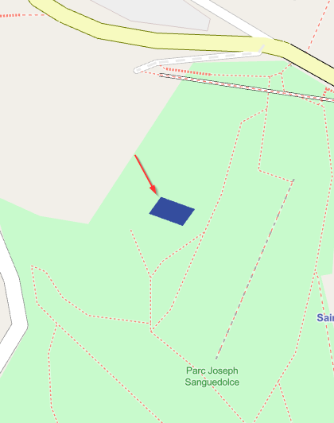  |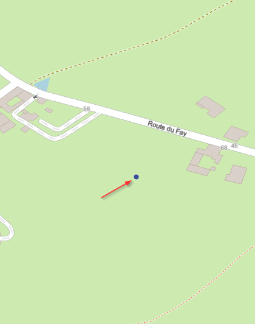  |
| :----------- | :--------------: |
|Le puits Couriot représenté par un polygone|Le puits Fay représenté par un point|
|URI Géo :[geo:45.437545,4.376720](geo:45.437545,4.376720?z=19) |URI Géo : [45.497218,4.539503](geo:45.497218,4.539503?z=19)|


Cela ne pose pas de problème majeur s'il s'agit de visualiser la distribution de cette données à l'échelle globale. 
Cependant, s'il s'agit d'analyser de la distribution de ces éléments à travers le globe (par maille de 30 arc minutes par exemple), deux solutions sont envisageables : 
- cacul des centroïdes des `way` et union avec la couche issues des `nodes` et ce pour chaque tag. Cela permet de n'avoir que des points à gérer.
- calcul de la distribution pour les `way`, puis pour les `node` et combinaison des résultats.

Par ailleurs, les `way` permettent de calculer des superficies ce qui n'est pas le cas des `node` par définition. Cela nous amène à un autre prblème.

### Deuxième problème

Un même objet peut-être à la fois représenté au format `node` et `way` (lignes *et/ou* (multi)polygones indentiques) et donc être comptabilisé (théoriquement) 3 fois sans que les attributs puissent être utilisés (si non renseignés) pour repérer les doublons (voire triplons).

Pour illustration, voici les exemples de deux mines :

|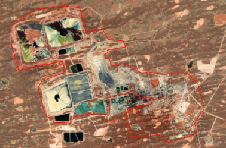  |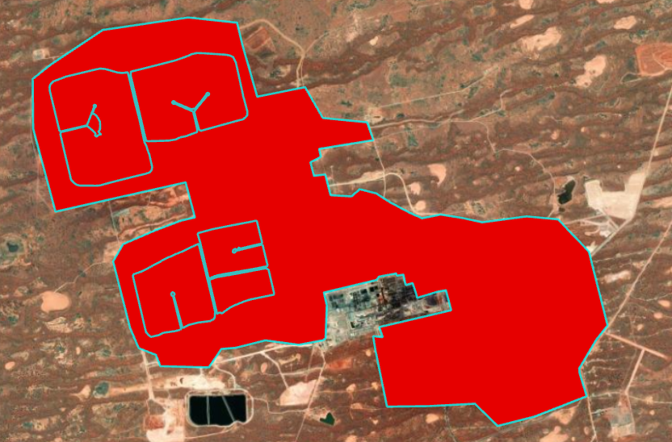  |
| ----------- | -------------- |
|Les *Olympic Dam Mines* (Australie) au format `ligne`|Les *Olympic Dam Mines* au format `multipolygone`|

URI Géo : [geo:-30.44024,136.87634](geo:-30.44024,136.87634?z=13)


|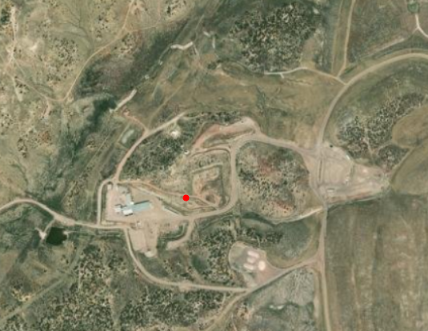|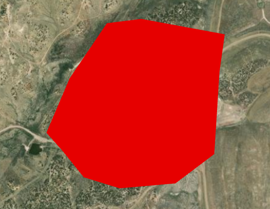|
| ----------- | -------------- |
|La *McKinley Mine* (Australie) au format `node`|La *McKinley Mine* au format `polygone`|

URI Géo : [geo:47.51003,-92.40773](geo:47.51003,-92.40773?z=15)

### Troisième problème

Pour un même site, plusieurs `way`peuvent avoir été utlisées, pour représenter des creux dans une surface par exemple. C'est le cas de la *Aitik copper mine* en Suède : 4 `way` de type `ligne` (dont une pour représenté un bassin de décantation), 1`way` de type `multipolygon` pour l'ensemble du site soit 5 objets pour un même site et un même `tag` (`Mine`).

|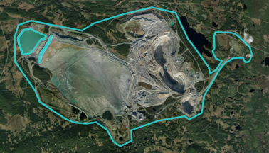|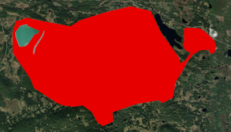|
| ----------- | -------------- |
|La *Aitik copper mine* au format `ligne`|La *Aitik copper mine* au format `polygone`|

URI Géo : [geo:67.06549,20.90707](geo:67.06549,20.90707?z=13)

Cela se complique même si l'on ajoute le `tag` `Tailings pond`. Cela rajoute 2 `way` : une ligne et un polygone

|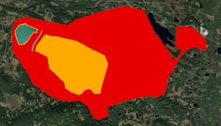|
| ----------- |
|La *Aitik copper mine* pour le `tag` `Tailing pond`|

URI Géo : [geo:67.06549,20.90707](geo:67.06549,20.90707?z=13)

Dans cet exemple, nous avons un site qui est constitué de 7 objets pour 2 `tag`. 

## Géotraitements

### Obtenir une couche des activités minières

#### La distribution des activités minières contemporaines mondiales dans OSM

L'idée est de limiter chaque zone d'activités minières à un seul objet chacune. Nous faisons le choix d'un hiérarchie des types d'objets privilégiant d'abord les polygones, puis les lignes, puis les points.

##### Étape 1 : Merge de toutes les couches selon le type d'objet

Les géotraitementt sont réalisés dans Arcgis Pro que nous utiliserons pour la diffusion des résultats via ArcGIS Online (mais ils auraient très bien pu l'être dans QGIS)

Nous cherchons tout d'abord à limiter le nombre de couches de manière n'avoir à manipulier que 3 couches portant respectivement l'ensemble des points, des lignes et des polygones.

Nous utilisons la fonction `Fusionner` (`Merge`) : N

Puisque nous avons pour objectifs de ne cartographier que les activités minières contemporaines, nous n'intégrons pas les données historiques.

Aussi, nous avons donc utilisé :
* pour les polygones :
    * industrial_eq_mine
    * industrial_eq_solution_mine
    * landuse_eq_mine
    * landuse_eq_mine_spoils
    * landuse_eq_quarry
    * man_made_eq_adit
    * man_made_eq_mineshaft
    * man_made_eq_spoil_heap
    * man_made_eq_tailings_pond
    * man_made_eq_heap

On obtient une couche portant 269 059 polygones.
     
* pour les lignes :
    * industrial_eq_mine
    * landuse_eq_mine_spoils
    * landuse_eq_quarry
    * man_made_eq_adit
    * man_made_eq_mineshaft
    * man_made_eq_spoil_heap
    * man_made_eq_tailings_pond
    * man_made_eq_heap

On obtient une couche portant 14 673 lignes.

* pour les points :
    * industrial_eq_mine
    * landuse_eq_mine
    * landuse_eq_quarry
    * man_made_eq_adit
    * man_made_eq_mineshaft
    * man_made_eq_spoil_heap
    * man_made_eq_tailings_pond
    * man_made_eq_heap

On obtient une couche portant 68 874 points.


Note : Le nom des trois couches obtenues intègre `merge` dans le projet ArcGiS Pro  


##### Étape 2 : Filtre éléments tagés comme historiques, abandonnés, inutilisés, détruits...

###### La couche `polygons`

Une série de `tag` identifiés plus haut est utilisée pour exclure ces éléments.

Les critères de sélection étant nombreux, nous avons opté pour le langage sql. La requête est disponible [ici](./scripts/historic_elements_filter.sql) 

Il s'interprère comme ceci :

```(historic = 'no' OR historic IS NULL)```


-> Filtre les lignes où `historic` est soit `no`, soit `NULL`.


```AND (other_tags IS NULL```

-> Ajoute les lignes où `other_tags` est `NULL`. L'absence de `tag` est considérée comme synonyme d'activité.

```OR (other_tags NOT LIKE '%"abandoned"=>"yes"%'```

-> Filtre les lignes où `other_tags` ne contient pas la chaîne de carcatères `"abandoned"=>"yes"` quelle que soit sa position.

```AND other_tags NOT LIKE '%"disused"=>"yes"%'```
-> Filtre les lignes où `other_tags` ne contient pas la chi^ne de carcatères  `"disused"=>"yes"` quelle que soit sa position.
``...``
-> Ainsi de suite pour tous les attributs.

Cette requête n'est valable que pour la couche polygones car elle seule contient un champ `historic`. Pour les points et les lignes, il faudra supprimer les 2 premières lignes.

Une première version de la requête incluant les `tag` metionnés plus haut permet de sélectionner tous les éléments qui ne sont pas des sites "historiques" (abandonnés, détruis...), soit 254 415 polygones sur les 269 059 qui nous avons extrait de d'OSM, soit 94.5%.

###### Analyse de la sélection

Une première analyse du résultat permet d'identifier toute une série de `tag` "non officiels" qui renvoie au caractère "ancien des sites".

Une recherche dans la sélection en utilisant l'argunement `abandoned` nous renvoie 168 occurences, dont 39 "abandoned"=>"no". Nous avons donc 129 "faux positifs" potentiels sur ce critère, nombre que l'on pourrait considéres comme étant portion concrue au regard de l'ensemble des points. 

Parmi ceux à, on trouve en effet :
"abandoned"=>"quarry" -> 5
"disused"=>"quarry" -> 1
"abandoned:quarry"=>"yes" -> 10
"abandoned:amenity"=>"quarry" -> 1
"description"=>"Abandoned quarry" -> 2
"description"=>"abandoned mine" -> 1 
"quarry"=>"abandoned" -> 31
"state"=>"abandoned" -> 1
"abandoned:building"=>"yes","industrial"=>"mine" -> 3
"abandoned:landuse"=>"abandoned:quarry" -> 8
"abandoned:landuse"=>"industrial" associé à une ressources "resource"=>"uranium" -> 3 ou au tag  "industrial"=>"mine" -> 1 
"abandoned:landuse"=>"yes" -> 10
"operational_status"=>"abandoned" -> 11
"operator"=>"Abandoned" -> 7 (dont 2 avec une majuscule)

On trouve même quelques curiosité :
"abandoned:amenity"=>"prison_camp" -> 4 en Sibérie...

Une recherche  dans la sélection sur le terme `disused` renvoie 195 occurences, dont 54 ""disused"=>"no". Nous avons donc 145 "faux positifs" potentiels sur ce critère, nombre que l'on pourrait considéres comme étant portion concrue au regard de l'ensemble des points. 

Parmi ceux à, on trouve en effet :
"designation"=>"Disused" -> 4
"disused"=>"quarry" -> 37
"status"=>"disused" -> 27
"state"=>"disused" -> 4
"description"=>"Disused (...)" -> 10
"disused"=>"landuse" -> 3
"disused"=>"landuse=quarry" -> 2
"disused"=>"y" -> 1
"disused"=>"ye" -> 1
"disused"=>"yesw" -> 1
"disused:landuse"=>"yes" -> 6
"disused:quarry"=>"yes" -> 2
"disused:man_made"=>"quarry" -> 2
"operator"=>"disused" -> 5
"quarry"=>"disused" -> 19

"lit"=>"disused" -> 1 ? 
"disused"=>"no","end_date"=>"1961" -> incohérence

"disused:amenity"=>"theatre" ???

Avec `ruins`, on obtient une occurrnece : "ruins"=>"building" qui concerne un `heap`

Avec `heritage`, 20 occurences dont 19 sembelent correspondre en effet à des héritages, et 1 à une carrière exploitée par l'opérateur "Heritage Sand and Gravel LLC".

###### Ajustement de la requête

Il est alors possible d'ajouter d'intégerer ces élémenst dans la requête. Plus plus de lisibilité, elles sont ajouter en fin de requête.

Ainsi, on obtient une couche de 254 216 polygones correspondant *a priori* à des zones d'extraction actives.

Il est alors possible de créer une nouvelle couches avec les entités sélectionner vers une nouvelle.

###### La couche `lines`

En appliquant le requête à la couche `lines` (après avoir, comme expliqué plus haut, supprimé la première ligne et le `AND` de la seconde ligne), on obtient une sélection de 13 542 lines (sur les 14 673 extraites depuis OSM, soit 92.3%)

Comme précédemment, on peut analyser cette sélection au prisme des mêms mots clés que précédemment.

`abandoned`renvoie 13 occurences dont :
* "abandoned"=>"no" -> 2
* "abandoned:landuse"=>"landfill -> 5  (en fait des spoils heaps )
* "description"=>"An Abandoned Mine" -> 1
* "abandoned:landuse"=>"industrial" -> 3

`disuded`renvoie 15 occurences dont :
* "disused"=>"no" -> 3
* "disused:landuse"=>"industrial" -> 2 
* "disused:building"=>"industrial" -> 2 
* "mineshaft_type"=>"disused" -> 1
* "operator"=>"Disused" -> 1
* "description"=>"Disused (...)" -> 1
et 
* "disused:resource"=>"coal" associé à "heritage"=>"8","heritage:operator"=>"UntereDenkmalbehörde" et * "historic"=>"heritage" -> 1

`heritage` renvoie 5 occurences dont 4 "historic"=>"heritage".


`historic` renvoie 16 occurences dont :
* "historic"=>"mine" -> 2
* "historic"=>"yes" -> 4
* "historic"=>"heritage" -> 4
* "historic"=>"mine_shaft" -> 2
* "description"=>"Display of a historic headframe" -> 1
* "description"=>"historiczna hałda" -> 1 (tas historique en polonais)
* "historic:civilization"=>"modern" -> 1

Il est là encore possible ajuster la requête en ajoutant quelques contraintes. Ce faisant nous optenons un nombres de 13 511 lignes.

###### La couche `points`

Nous obtenons une sélection de 53 829 points sur les 68 874 extraits d'OSM.

Un filtre sur le mot clé `abandoned` donne 103 occurrence  dont 69 "abandoned"=>"no"
* "abandoned:man_made"=>"mine
* "operator"=>"abandoned" -> 
* "mine"=>"abandoned"
* "description"=>"Abandoned (...)"
* "condition"=>"abandoned"
* "abandoned:military"=>"bunker" conncerne des galerie
* "name:en"=>"Soviet abandoned adit"
* "abandoned"=>"*"
* "vent"=>"abandoned_mine_shaft" ??
* "operator"=>"DEM (SA Gov) Abandoned"
* "operator"=>"abandoned mine"
* "operator"=>"abandonned" -> 1
* "description"=>" (...)abandoned (...)
* "abandoned:man_made"=>"yes"
* "abandoned:bunker_type"=>"bomb_shelter","abandoned:military"=>"bunker","abandoned:name"=>"Rosenauberg",* "access"=>"no"
* "abandoned"=>"true"

Un filtre sur le mot clé `disused` donne 161 occurrences dont 130 "disused"=>"no"

* "disused:leisure"=>"closed"
* "disused:adit_type"=>"bomb_shelter" (pour adit)
* "disused:military"=>"shelter"
* "disused:amenity"=>"adit"
* "disused:mine"=>"yes"
* "disused"=>"amenity" (pour quarry)
* "description"=>"disused"
* "description"=>"(...) disused (...)"
* "disused"=>"*"
* "disused:resource"=>"(...)"

Un filtre sur le mot clé `historic` donne 274 occurrences dont quelques "historic"=>"no"
* "historic"=>"ruins"
* "historic:period"=>"roman_republic"
* "historical_and_cultural_sites:level:CN"=>"provincial"
* "historic:civilization"=>"modern"
* "historic"=>"tes"
* "historic"=>"technical_monument"
* "historic"=>"shelter"
* "historic"=>"razed:mineshaft"
* "historic"=>"mining"
* "historic"=>"quarry"
* "historic"=>"monument"
* "historic"=>"mineshaft"
* "historic"=>"mine_adit"
* "historic"=>"industrial"
* "historic"=>"bunker"
* "historic"=>"military"
* "historic"=>"building"
* "historic"=>"boundary_stone"
* "historic"=>"archaeological_site"
* "historic"=>"adit"
* "historic"=>"mine_level"
* "attraction"=>"historic"
* "heritage"=>"2", "heritage:operator"=>"Historic England"
* "historic"=>"memorial"
* "historic"=>"tunnel_entrance"
* "description"=>"(...)historic(...)" 
* "archaeological_site"=>"mineral_extraction"

On peut aussi ajouter quelques fautes de frappe :
* "operator"=>"abandonned"
* "historic"=>"quaary"
* "historic"=>"tes"

On pourrait aussi envisager de prendre ne compte la présence de la clé "end_date" qui indique *a priori* un élément qui n'est plus actif. 

Un tag a également attiré notre attention : "natural"=>"cave_entrance", représentant 310 occurences, et qui logiquement doit renseigner des grottes et non pas des galeries (elles sont issues du l'usage du `tag` `man_made=adit` qui doit être utilisé pour les galeries de mine). Le terme `cave` est utilisé 65 autres fois (*e.g.* : "name:en"=>"Cave", "name:en"=>"Figueiral cave",) 

Bien sûr, une fois de plus, la fiabilité des données dépend du bon usage que le contributeur fait de ces `tag`. Par exemple, on peut retrouver , ce cas suivant :
"name:es"=>"Minas Bezunartea","name:eu"=>"Bezunarteko mealekuak","natural"=>"cave_entrance" ([URI géo: 43.035126,-1.255329](geo:43.035126,-1.255329?z=19)
Ici ets mantioné une mine (qui est *a priori* inutilisée) et une entrée de grotte.

Ces cas correspondent tout de même à une très infime minorité au regard de l'ensmble de ces objects.

Il est cependant possible d'ajouter quelques arguments à la requête de sélection.

Cela nous permet de sélectionner plus que 53 197 points (au lieu des 53 829 intialement sur 68 874 au total.

Cette requête "augmentées" peut être utilisé de nouveaux sur les lignes et les polygones.

| Caractéristiques | requête V1 | requête V1 ajustée  | requête V2 | Total |
| ----------- | ----------- | -----------  | ----------- | ----------- |
| polygons | 254 216 | -  | 254 077 | 269 059 |
| lines | 13 542 | 13 511  | 13 504 | 14 673 |
| points | - | 53 829  | 53 197 | 68 874 |

Note : Chaque fichier obtenus successivement le suffixe `clean` dabns le projet ArcGIS

##### Étape 4 : Sélection par localisation

###### Préparation : fusion des polygones

La couche `polygons` (obtenue après le "nettoyage" précédent) peut contenir les polygones enchassés les uns dans les autres ou des entités multiparties.

Notre objectif étant d'obtenir une localisation unique par site d'extraction, il convient de fusionner ces polygones et en empêchant la formation d'entités multiparties.

Dès lors, nous passons de 254 077 polygones à 244 258 correspondant à autant de localisations potentielles.

Note : dans le projet ARcGIS Pro, le nom du fichier prend le suffixe polygons_OK 

**Remarque imortante** : cette manipulation fait perdre les attributs. C'est nomal puisque des polygones portant des valeurs différentes pour une même attribut peuvent être fusionner. L'ajout de champs de statistiques est une solution en sélectionnant une concateantion des champs name, other_tags, MERGE_SRC, landuse, et man_made.

###### Sélection des lignes entretenant des liens avec des polygones

Cette couche va nous servir à éliminer dans les deux autres les caractéristiques `line` et `point` qui renseignent le même site et éviter des informations redondantes.

Nous utiliserons la sélection selon la localisation (selon l'emplacement).

Nous selections donc successivement en donc toutes les lignes :
* qui intersectent un polygone (7 889/ 13 504)
* qui touchent un polygone (7 247 / 13 504)
* sont dans un polygone (7 765 / 13 504)

Ces sélections peuvent renvoyer des résultats identiques (communes), mais elles se complètent. On note que les trois résultats sont sensiblement comparables.

Nous sélectionnons successivement les élements qui sont éventuellement (s'ils ne le sont pas déjà) ajoutés à la sélection courante.

7 889 lignes peuvent être éliminées. Nous inversons la sélection et créons une nouvelle couche ligne complémentaire avec la couche polygone. Cette couche comporte donc 5 615 sites potentiels.

###### Sélection des points entretenant des liens avec des polygones

On procède de même pour les points. Nous selectionnons donc tous les points :
* qui intersectent un polygone (5 470 / 53 197)
* qui touchent un polygone (2 407 / 53 197)
* sont dans un polygone (5 470 / 53 197)

5 470 points sont ainsi éliminés. Une nouvelle couche est créée portant 47 727 points

Note : le nom de chacune des 3 couches obtenues précédemment  porte le suffixe `OK` dans le projet ArcGIS Pro.


###### Sélection des points entretenant une relation spatiale avec des lignes sans liens avec des polygones.

Par ailleurs, des points peuvent également entretenir une relation spatiale avec des lignes elles même distincts de la couche polygones.

Certaines lignes, du fait de leur géométrie peuvent être transformer en polygones ce qui permettra de sélectionner des points de la même manière que précédemment. Cependant, il conviendra d'être attentif à un certain nombre de ces derniers du fait même de leur (réelle) nature.

Nous utilisons l'outil "Entités vers polygones". 5 220 lignes sur les 5 615 peuvent être transformées en polygones.

Note :  le nom de la couche les lignes transformées en polygones portent le suffixe `lines_OK_to_polygons`

Afin de conserver les lignes non transformées en polygones et sans relations avec ces derniers, on opte là encore pour une sélection selon l'emplacement (critère Intersection).

267 lignes sont autant de site potentiels.

Le nom du fichier porte le suffixe `lines_OK_no_polygons` dans le projet ArcGIS Pro

L'objectif est de ici de sélectionner les points qui entretiennent une relation au niveau de la limite mais aussi de la surface de ces nouveaux polygones. 


###### Suppression d'entités non pertinentes "lignes vers polygones" / calcul d'un indice de compacité

Cependant, il convient de faire un peu de ménage.

En effet, certains de polygones ainsi obtenus sont "atypiques". Ces derniers se retrouve majoritairement en Floride.

|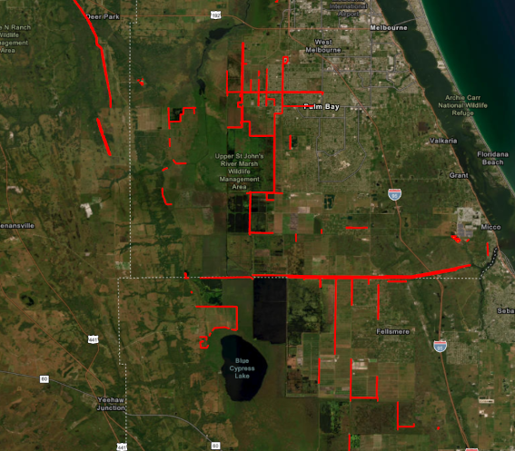|
| -----------  |
|*Florida atypic lines*|

Ces zones, taggées avec `man_made=spoil_heap`, semblent en lien avec des canaux. Peut-être les remblais ? Quoiqu'il en soit, elles sont sans lien avec des activités d'extraction minières. Il est donc nécessaire de les retirer.

De manière à automatiser leur sélection, nous avons opté pour l'utilisation d'un indice de forme exprimant le degré de compacité d'un polygone. Nopus en avons testé 2 
l'indice de compacité de Gravelius : K=P÷(2×sqr(πA)) = 0.28×(P÷sqr(A)) -> 1.12 si le polygone est carré et d'autant plus grand que le polygone est allongé.
et
celui de circularité de Miller : Rc = 4πA÷P² = (12.57×A)÷P² -> 0 : circularité minimale (périmètre très grand et surface très petite) et 1 (circularité maximale)

|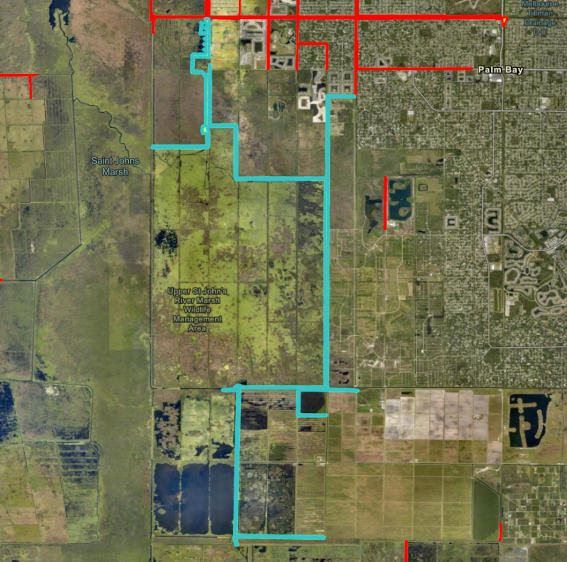|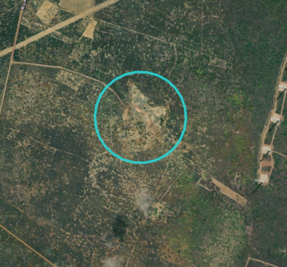|
| -----------  | -----------  |
|*K=9.632555 et Rc=0.003383*| *K=0.561511 et Rc=0.9995416* |


Un seuil de Rc < 0.25 permet de sélectionner 413 polygones sur les 5 220.

|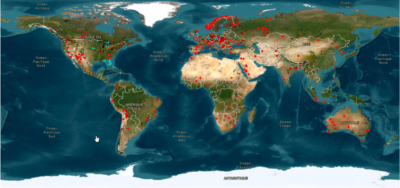|
| -----------  |
|*Locatisation des lignes tranformées en polygones avec Rc<0.25*|

La grande majorité (254) correspond aux polygones que nous cherchons à identifier en Floride.

Bien sûr, l'utilisation d'un tel seuil peut provoquer par ailleurs la mise en évidence de polygones potentiellement intéressants (ou non).

C'est le cas par exemple de :

* galeries de mine (sans que mention soit fait d'une activité)

|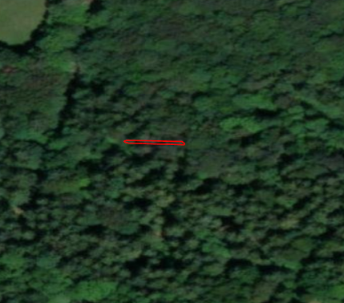|
| -----------  |
|*man_made=adit ; Rc<0.25*|

Solution : exclusion selon les `tag`

* enceintes de stockage associées à des centrales thermiques

|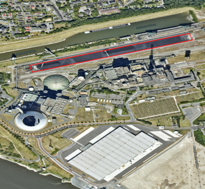|
| -----------  |
|*man_made=heap et resource=coal ; Rc<0.25*|


* de zones *a priori* mal renseignées comme une moraine dans la réserve naturelle de la Bessa (Italie)


||
| -----------  |
|*man_made=spoil_heap ; Rc<0.25*|

* des objets complexes au sein de complexes
Ici une association de lignes portant le `tag` man_made=tailings_pond ou man_made=spoil_heap et associé à uine autre bassin au format polygones et surtout à la mine de Neves-Corvo localisée à quelques centaines de mètres au nord-ouest figurée elle aussi  dans OSM sous forme de polygone.

|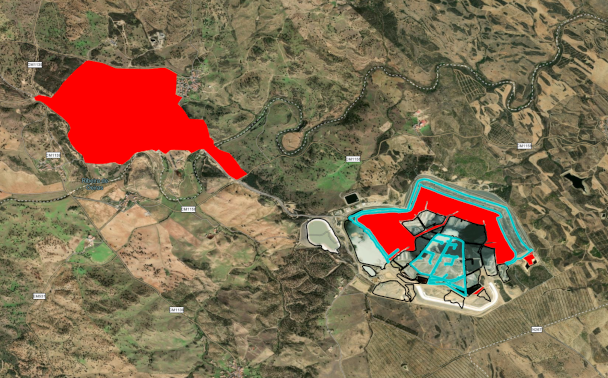|
| -----------  |
|*Complexe minier ; Rc<0.25*|


On trouve également d'autres types de sites, notamment des bassins de décantation/rétention associé à des zones d'extraction sans que ces dernières soient minières.

On note donc ici l'importance :
* des `tag` considérés et la nécessité de réfléchir à ceux à intégrer
* le poids des contributeurs :
    * objets digitalisés
    * choix du type de géométrie
    * légitimité des `tag` utilisés

Un tri manuel n'étant pas envisagé, le nombre de sites concernés étant fible au regard de l'effectif mondial, nous avosn  choisi d'écarter ces sites.

On sélectionne donc les polygones dont le Rc est supérieur ou égal à 0.25. On crée une nouvelle couche qui inclue uniquement 4 807 polygones.

Note : le fichier prend le suffixe _RcSup0pt25 dans le projet ARcGIS Pro

Un recherche par localisation permet d'éliminter seulement 91 points sur 47 727. Ajouter les points qui touchent un des autres lignes amène le totales à 125 points éliminé.

Il est possible de créer une nouvelle couche de 47 636 points sans aucun relation spatiale avec des lignes et/ou des polygones.

Note : le fichier prend le suffixe _solo dans le projet ARcGIS Pro

##### Étape 5 : Application d'un indice de compacité sur les polygones "vrais" 

On note que la couche des polygones peuvent également avoir des formes très linéaires.

|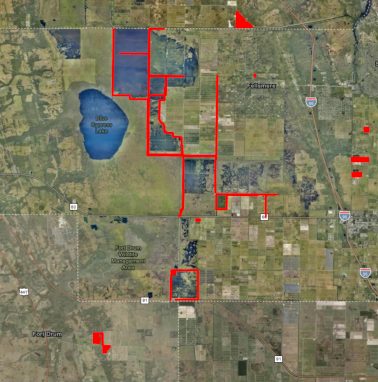|
| -----------  |
|Polygone de forme linéaire|

Il est possible de proposer un seuil du Rc. Un seuillage à 0.05 semble donner de bons résutats, sélectionnant 467 polygones sur 244 258 même s'il inclue des polygones de formes complexes.


|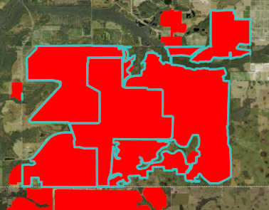|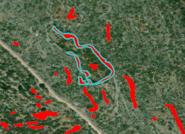|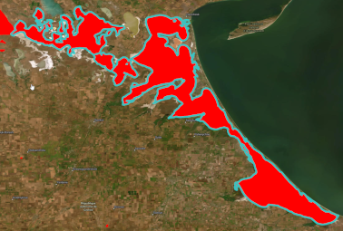|
| -----------  | -----------  | -----------  |
|Polygone complexe (Rc<0.05) - quarry|Polygone complexe (Rc<0.05) - heap|Polygone complexe (Rc<0.05) - tailings pond|

Cependant, au vu du nombre d'objets, il semble compliquer de traiter individuellement ces cas particuliers.

Une nouvelle couche est créée comportant 243 791 polygones.

Note : le fichier prend le suffixe _RcSup0pt05 dans le projet ARcGIS Pro.

Il est alors possible de fusionner l'ensemble des polygones c'est à dire les deux fichiers seuillés à l'aide du Rc

Note : le fichier s'appelle OSM_mines_Merge_all_polygons_v1 dans le projet ARcGIS Pro.

Ce fichier porte 248 598 entités.

##### Étape 6 : Simplificaton des sites complexes 

Certains sites sont constitués de plusieurs polygones très proches (de quelques mètres)

Nous proposons d'agréger ces entités par dilatation/érosion. Pour ce faire, un buffer de 150m est appliqué (en prenant soit de fusionnr les buffer résutants)(OSM_mines_Merge_all_polygons_v2_temp), puis un autre de -150m (OSM_mines_Merge_all_polygons_v2).


|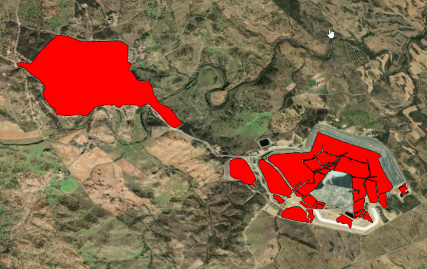|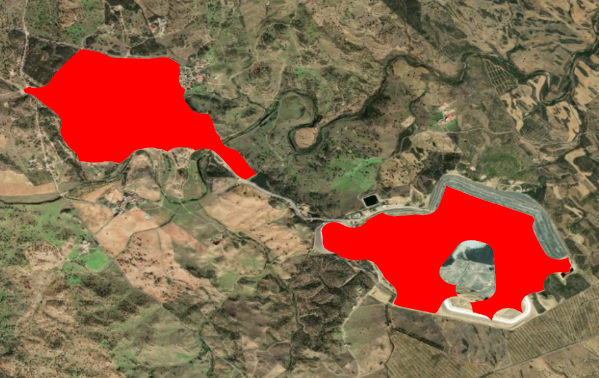
| -----------  | -----------  |
|Polygone complexe avant dilation/érosion|Polygone complexe après dilation/érosion|

Bien sûr, cette méthode, comme toute application de seuillage, à ces limites, 'elle pourrait regrouper des sites distinctes, ou bien n'être pas suffisantes dans certains autres cas. 

##### Étape 7 :  Obtention d'un point par site

Pour chaque ligne et pour chaque polygone, nous calculons les centroïdes. Cela nous permet d'obtenir un point par site.

Nous utilisons la fonction "Entités vers points" en forçant, pour les polygones, le déport du point à l'intérieur de la surface.

OSM_mines_Merge_all_polygons_v2 -> OSM_mines_lines_to_points_centroid
OSM_mines_Merge_lines_OK_no_polygons -> OSM_mines_lines_to_points_centroid

Il est alors possible de regrouper ces deux couches avec la couche OSM_mines_Merge_points_OK_solo pour obtenir une seule et même couche de points.

|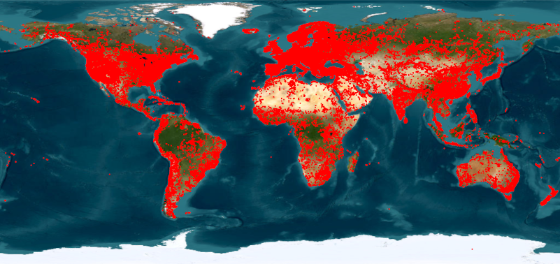|
| -----------  |
| Sites d'extraction V1 |

On obtient alors un fichier portant  210 338 points correspondant à autant de sites potentiels d'extraction.

### Regard critique sur le fichier obtenus

* abscence d'attributs pour la couche de polygones OSM
    * Cause : fusion au début de l'étape 4.
    * Solutions :
      * utilisation de champs statistiques (pb : le calcul de ces champs est très long)
      * répuration des atrribut par jointure spatiale

* Beaucoup de points par rapport aux autres études
    * Cause probable : notre premier test inclues des tag qui ne sont pas pertinents dans le contexte des extractions strictments minières
    * Solutions :
        * tri *a priori* :
            * abandon de certain `tag` (*e.g.*: quarry, heap, tailings_pond, solution_mining...). Noter que cela peut écarter des zones minières 
            * maintien de certaines entités en fonction de leur contexte spatial
        * tri *a posteriori* :
            * sélection via le `tag` `ressource` quand il est renseigné
            * rfélexion à la mobilisation d'autres `tag`


### Comparaison avec Maus et *al.* (2022) et Tang and Werner (2023)

#### Maus et *al.* (2022)

13 362 sur nos 210 338 points (6,35%) sont dans un polygone identifié par Maus et *al.* (2022)   
10 353 sur les 44 929 (29.74%) de Maus et al. (2022) contiennent un de nos points.

#### Tang and Werner (2023)

10 408 sur nos 210 338 points (4,95%) sont dans un polygone identifié par Tang et Werner (2023)   

9 488 sur 74 548 (12.72%) de Tang and Werner (2023) contiennent un de nos points.

Ces résultats sont tout de même très décevants.

Si nous avons conscience que nous avons de nombreux points qui ne sont pas en lien avec l'extraction minière *stricto sensuis* (e.e. sablières, gravières, carrières, amas de nature différentes...) il s'avère qu'en plus, un nombre limité des points identifiés sont inclus des zones identifiées *a priori* comme des zones minières par les deux études considérées. 

## Analyse des contributions

L'utilsation sur l'ensemble des fichiers XML des scripts `python` [`single_user_list.py`](./scripts/single_user_list.py) puis [`user_information.py`](./scripts/user_informations.py) permet d'obtenir le fihcier `csv`. Il est disponible sous forme d'archive 7zip dans le dossier `data` sous le nom [utilisateurs_uniques_avec_changeset_avec_user_info](./data/utilisateurs_uniques_avec_changeset_avec_user_info.7z) .

Une rapide analyse decriptive est disponible [ici](./public/utilisateurs_uniques_avec_changeset_v1.html) et ci-dessous.

|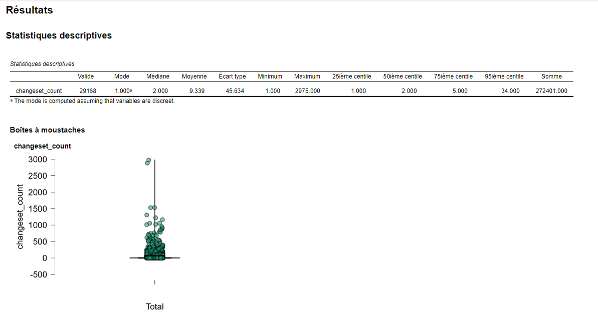|
| -----------  |
| Stats descriptives V1 |

En gros, beaucoup d'utilisateurs (75%) avec entre 1 et 5 `changeset` et très peu avec 34 `changset` et plus... 

Ca reste à affiner, mais c'est pas ma spécialité ;-).


## Bilan

Quelques choix complémentaires pourrait être  sont nécessaires pour identifier les sites "uniques".


* utilisation du `tag` `ressource` 
* une concentration des `tag` utilisés
* utilisation des `tag` en lien avec la période d'activité

Utilisation de mots clés de type ancien, former ? (*e.g.* Landsburg Mine site)


### Quelques pistes de `tags` supplémentaires à envisager 

Le [tag `resource`](https://wiki.openstreetmap.org/wiki/FR:Key:resource) peut renseigner le(s) minerai(s) extrait(s)

Le [tag `source`](https://wiki.openstreetmap.org/wiki/FR:Key:source) peut renseigner la source (carte, BdD ou observation terrain (`source=survey`))

~~## Quelques stats (rapides)~~

~~Ces chiffress ne portent que sur les `node` pour l'instant~~

~~### Couche Galerie~~

~~#### Tag `source`~~

~~17 305 sur 20 076 n'ont pas de source soit  86%~~

~~Concernant le nombre de sources uniques, on en décompte 370, mais une même source peut-être nommé de différente façon (*e.g.* USGS Topo, USGS Topo map, USGS topographic map, USGS Topographic Maps). Il travaille de tri s'impose.~~

~~#### Tag `resource`~~
 
~~15 905 sur 20 276 n'ont pas de d'attribut `resource` (79.2%)~~

~~Là aussi, problème de nommage (casse, langue, séparateur...)~~

~~Les exports au format ASC sont disponibles dans le [dossier `data`](./data/)~~


# Autres bases et ressources à (potentiellement) explorer

## Mines

### France métropolitaine et d'outre-mer

[CAMINO](https://camino.beta.gouv.fr/)

### Guyane

[Schéma Départemental d'Orientation Minière (SDOM) Guyane](https://catalogue.geoguyane.fr/geonetwork/srv/api/records/024631df-f40f-4870-8e13-baadf866d1fe)

[Autorisations (AEX) et titres miniers terrestres de Guyane](https://catalogue.geoguyane.fr/geonetwork/srv/eng/catalog.search#/metadata/dc50167d-c0a4-466c-a2b1-cd25607af340)

[Autorisation d'exploitation minière (AEX) de Guyane](https://catalogue.geoguyane.fr/geonetwork/srv/eng/catalog.search#/metadata/67312393-4a4c-4122-8071-aef2ac08c266)

### Monde


## Ressources en minerai et minéraux

[Mineral Resources Data System (MRDS)](https://tin.er.usgs.gov/mrds/)

Il semble que la banque mondiale dispose d'une base de données. A fouiller.

[USGS Mineral Resources Online Spatial Data](https://mrdata.usgs.gov/general/map-global.html)